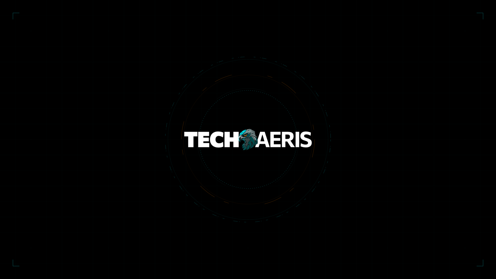

# Omarchy Techaeris Theme

Techaeris is a premium, sleek cyberpunk theme for Omarchy featuring high-tech cyan/teal accents, deep charcoal backgrounds, and a high-contrast futuristic layout. It includes gorgeous bespoke ASCII art for the System About and Screensaver views, matching menu colors, custom unlock screens, and an exquisite collection of theme-specific wallpapers.

## Preview




## Install

### 1. Install the Theme
You can install this theme directly using the built-in Omarchy theme manager command:

```bash
omarchy theme install https://github.com/techaeris/omarchy-techaeris-theme
```

Once installed, apply the theme:
```bash
omarchy theme set techaeris
```

### 2. Install the Branding Hook (Highly Recommended)
This theme includes custom bespoke ASCII art for the **About** (`fastfetch`) and **Screensaver** (`ttfx`) commands. To have Omarchy automatically load these files when you apply the Techaeris theme (and automatically restore system defaults when you switch to other themes), install the bundled branding hook:

```bash
omarchy hook install theme-set ~/.config/omarchy/themes/techaeris/hooks/theme-set/apply-branding
```

That's it! The hook is now registered. Every time you switch to the `techaeris` theme, your system about panel and screensaver will display the beautiful custom Techaeris artwork.

---

## What's Included

- **Futuristic Palette:** Native Omarchy Quattro theming through `colors.toml` and `shell.menu.toml`, offering a clean and glowing high-tech cyan scheme (`#0DC7CB`) on dark backgrounds.
- **Bespoke Branding & Art:**
  - `about.txt`: Custom large futuristic terminal ASCII art of the Techaeris logo.
  - `screensaver.txt`: Custom braille-style block ASCII art wordmark for the terminal screensaver.
- **Stunning Wallpapers:** A curated collection of tech and digital horizon backgrounds stored in the theme's `backgrounds/` folder.
- **Matching Core Assets:** Fully themed lock/unlock screen overlays (`unlock.png`, `preview.png`, and `preview-unlock.png`).
